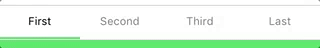
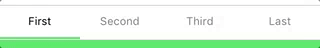
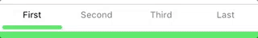
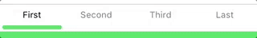
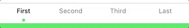
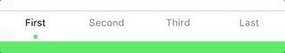
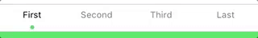
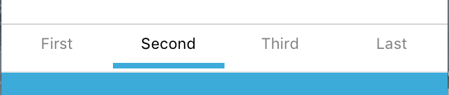
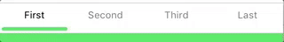
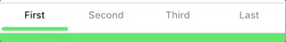

# PagerViewController

A basic pager ViewController for Xamarin.iOS.


## Getting started

```csharp
var colors = new[]
{
	UIColor.FromRGB(76,217,100),
	UIColor.FromRGB(52,170,220),
	UIColor.FromRGB(88,86,214),
 	UIColor.FromRGB(255,45,85),
};

var pages = new[]
{
	new UIViewController() { Title = "First" },
	new UIViewController() { Title = "Second" },
	new UIViewController() { Title = "Third" },
	new UIViewController() { Title = "Last" },
};

var style = new PagerStyle()
{
    SelectedStripColors = colors,
};

var pager = new PagerViewController(style, pages);

var nav = new UINavigationController(pager);
nav.NavigationBar.Translucent = false;
```

## Styling

### Predefined styles

You can pickup one of the predefined styles.

`PagerStyle.Default`



`PagerStyle.NotAnimated`



`PagerStyle.Stretched`


`PagerStyle.Rounded`



`PagerStyle.RoundedNotAnimated`


`PagerStyle.RoundedStretched`



`PagerStyle.Dot`



`PagerStyle.DototAnimated`



`PagerStyle.DotStretched`



### Custom

You can customize appearance of your tabs with the properties of a `PagerStyle` instance.

#### Strip style

`StripStyle.None` *(default)*



`StripStyle.Rounded`


`StripStyle.Dot`


#### Strip animation

`StripAnimation.Constant` *(default)*


`StripAnimation.Stretched`



`StripAnimation.None`



## Roadmap / Ideas

- [X] ViewController
- [X] Animations
	- [X] None
	- [X] Constant
	- [X] Stretched
- [X] Styles
	- [X] None
	- [X] Rounded
	- [X] Dot
- [ ] Setup NuGet
- [ ] More customization
- [ ] Icons
- [ ] Dynamic tabs modification
- [ ] Storyboard integration


## About

This view controller did the trick but is far from a real polished software and needs some work for real customization. Meanwhile, it can save some time to someone, maybe ... And I'll not lost it!

## Contributions

Contributions are welcome! If you find a bug please report it and if you want a feature please report it.

If you want to contribute code please file an issue and create a branch off of the current dev branch and file a pull request.

### License

MIT © [Aloïs Deniel](http://aloisdeniel.github.io)